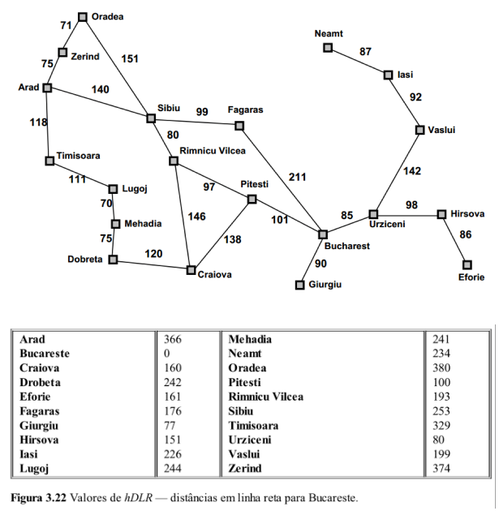

Curso de Especialização de Inteligência Artificial Aplicada

Setor de Educação Profissional e Tecnológica - SEPT

Universidade Federal do Paraná - UFPR

---

**IAA003 - Linguagem de Programação Aplicada**

Prof. Alexander Robert Kutzke

Aluno: Bruno Luvizotto Carli

# Exercício de implementação do Algoritmo A*.

Implemente a função `a_star` do arquivo [a_star.py](a_star.py) presente no repositório.

O destino será sempre **Bucharest**.

O arquivo [dists.py](dists.py) descreve estruturas de dados que representam as
seguintes informações:



# Resolução

A função implementada foi adaptada de [CARLI (2021)](https://github.com/brunolcarli/IPythonNotebooks/blob/master/IAUFPR/intro_IA/heuristic_search.ipynb) em trabalho
apresentado à disciplina de Introdução a Inteligência Artificial. O professor
Razer havia pedido somente o diagrama, mas ~~eu~~ o autor havia implementadi
o código para o algoritmo, que resultou na resolução do link citado.

Foram adicionados um módulo de utiitários e um módulo `main`, assim como um
atalho de execução via Makefile, caso pretenda executar em ambiente Unix.

## Executando

### Linux/ Mac OS

Pode-se executar o programa através do comando:

```
$ make run
```

### Windows / Outros Sistemas Operacionais

Executar através do próprio python:

```
> python3 main.py
```

## Interagindo com o software

Inicialmente o software solictará uma entrada de texto:

```
----------------------------------

    ╔╗ ┬ ┬┌─┐┬ ┬┌─┐┬─┐┌─┐┌─┐┌┬┐
    ╠╩╗│ ││  ├─┤├─┤├┬┘├┤ └─┐ │
    ╚═╝└─┘└─┘┴ ┴┴ ┴┴└─└─┘└─┘ ┴
            ╔═╗┬┬─┐┬  ┬┌┐┌┌─┐┌─┐
            ╠═╣│├┬┘│  ││││├┤ └─┐
            ╩ ╩┴┴└─┴─┘┴┘└┘└─┘└─┘


Encontramos a melhor rota
de qualquer lugar na Romênia para Bucareste.


Developed by: Bruno L. Carli
----------------------------------
Insira o nome do ponto de partida:
```

Baseado na sua entrada (que deve ser uma cidade válida da Romênia) o software
utilizará o algoritmo A-estrela para buscar a melhor rota. A lista retornada
da função do algortmo é formatada e apresentada na tela:

```
Insira o nome do ponto de partida:
Oradea

Melhor Solução encontrada:
Oradea -> Sibiu -> Rimnicu Vilcea -> Pitesti -> Bucharest

Deseja continuar? sim/não
```


# Referências

CARLI, B. L; **Busca heurística**. Github, 2021. Disponível em: https://github.com/brunolcarli/IPythonNotebooks/blob/master/IAUFPR/intro_IA/heuristic_search.ipynb